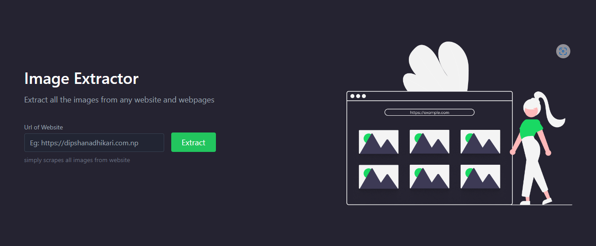

<h1 align="center">Image Extractor</h1>
<h3 align="center">
  A basic web app to extract all the images from website
</h3>

<br>



## Built with

These were the main technologies used in this project :

-   [Express](https://expressjs.com/): Node.js web application framework
-   [Node.js](https://nodejs.org/en/) : A JavaScript runtime built on Chrome's V8 JavaScript engine.
-   [Puppeteer](https://pptr.dev/) : A Node library which provides a high-level API to control Chrome or Chromium over the DevTools Protocol.
-   [React](https://reactjs.org/) : A JavaScript library for building user interface

## Usage

To clone and run this application, you'll need [Git](https://git-scm.com/downloads) and [Node.js](https://nodejs.org/en/download/) (which comes with npm) installed on your computer. From your command line:

```bash
# Clone the repository
$ git clone https://github.com/dipshanadh/mern-gigs.git
folder

# Go to the the client folder of the project
$ cd mern-gigs/client
# And build the frontend app
$ npm install && npm run build


# Now start the server from the root project folder
$ cd ../
$ npm install && npm start
```

Now, open http://localhost:5000 in your favorite browser

## Author

### Dipshan Adhikari

-   Website : [dipshanadhikari.com.np](https://dipshanadhikari.com.np)
-   Facebook : [dipshanadh](https://facebook.com/dipshanadh)
-   Instagram : [dipshanadh](https://instagram.com/dipshanadh)
-   Twitter : [@dipshanadh](https://twitter.com/@dipshanadh)
